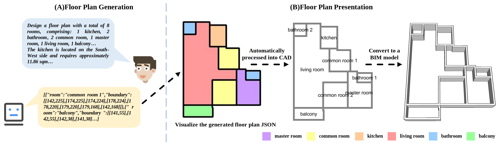
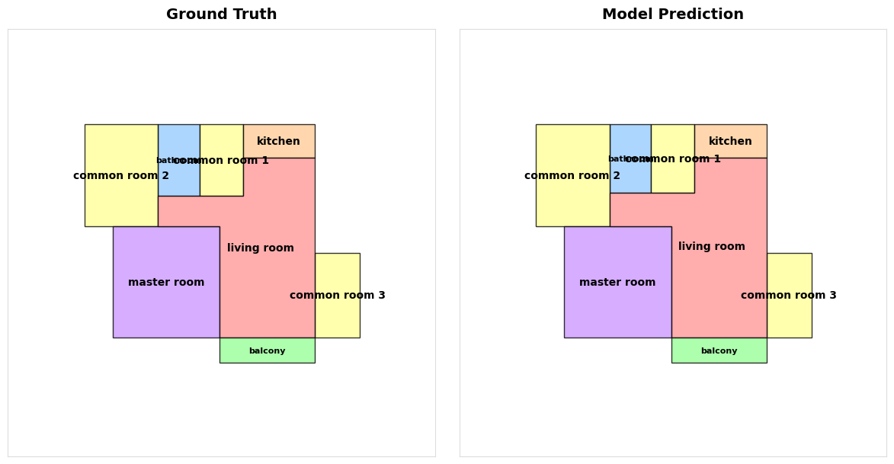
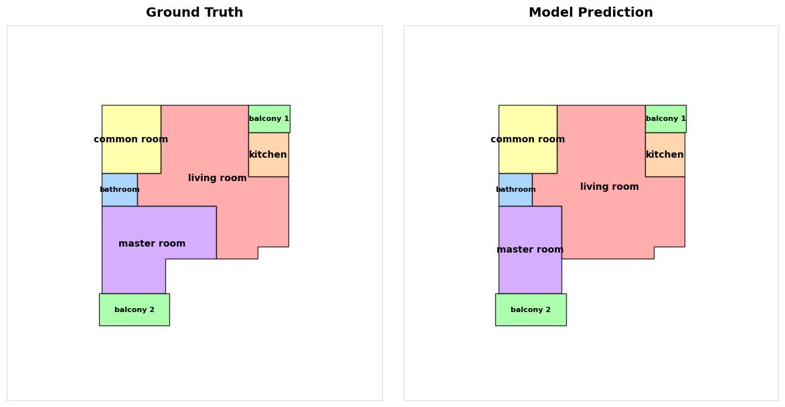

# HSK-LLM: Hierarchical Spatial Knowledge-Guided Large Language Models for Floor Plan Generation
<p align="center">
  
  <br>
  <em>Figure 1:  Overview of the floor plan generation pipeline.</em>
</p>

## 🏠 Abstract

To effectively explore automated generation of floor plans in the architecture industry, some remarkable progress in such a novel feasible paradigm for transforming floor plan design into natural language generation tasks, especially large language models have been witnessed during these years. However, existing methods still face significant challenges in this task, primarily manifested in the lack of effective semantic representations and the difficulty in strictly satisfying complex spatial and geometric constraints, resulting in sub-optimal generation quality. 

To address these issues, this paper proposes a **Hierarchical Spatial Knowledge-Guided Large Language Models (HSK-LLM)** for floor plan generation framework. Specifically:
1. **Macro-View:** We propose a **dual-reference spatial encoding mechanism** to explore multi-view semantic from raw data, effectively resolving the ambiguity in spatial semantic descriptions.
2. **Micro-View:** A group of **explicit constraints** (adjacency topology, boundary, and bounding box) is designed to rigorously regulate the spatial topology logic and geometric accuracy, effectively suppressing geometric hallucinations.

Experimental results demonstrate that our model significantly outperforms baselines, while effectively adhering to complex semantic instructions and explicit geometric constraints.

<p align="center">
  
  <br>
  <em>Figure 2: The overall architecture of the proposed HSK-LLM framework.</em>
</p>

## 🛠️ Installation

```bash
git clone [https://github.com/Zja-33/HSK-LLM.git](https://github.com/Zja-33/HSK-LLM.git)
cd HSK-LLM
pip install -r requirements.txt
```

## 🧠 Training
Our model is trained using the [LLaMA-Factory](https://github.com/hiyouga/LLaMA-Factory) framework. We provide a sample configuration file and dataset to demonstrate the training pipeline.

### 1. Environment Setup
First, ensure LLaMA-Factory is installed:

```bash
git clone [https://github.com/hiyouga/LLaMA-Factory.git](https://github.com/hiyouga/LLaMA-Factory.git)
cd external/LLaMA-Factory
pip install -e .[metrics]
```

### 2. Data Registration
To use our dataset with LLaMA-Factory, you need to register it in external/LLaMA-Factory/data/dataset_info.json.
Copy our data to the LLaMA-Factory data directory (or link it).

### 3. Start Training
We provide a configuration file configs/HSK-LLM-sft-config.yaml that contains all the hyperparameters used in our paper.
Run the following command to start fine-tuning:
```bash
llamafactory-cli train configs/HSK-LLM-sft-config.yaml
```

## 📂 Dataset (Coming Soon)
The full dataset and data processing pipeline will be made publicly available
We have provided several sample data in the data/ directory.
The img_sample/ directory contains comparison images of predicted floor plans and actual floor plans derived from example data.
<p align="center">
  
  
  <br>
  <em>Figure 3: Inference comparison chart corresponding to example data.</em>
</p>

##